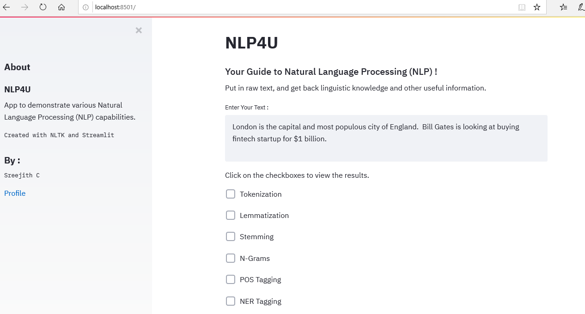

## NLP4U
+ Your Guide to Natural Language Processing (NLP) !




#### Description

This is a Natural Language Processing (NLP) Based App useful for basic NLP concepts such as follows :

+ Tokenization
+ Stemming
+ Lemmetization
+ PoS tagging
+ NER Extraction

#### Libraies Used
```bash
nltk
streamlit
```

#### Run
```bash
streamlit run app.py
```

#### Author
+ Sreejith C
+ https://sites.google.com/site/sreejithc321/
