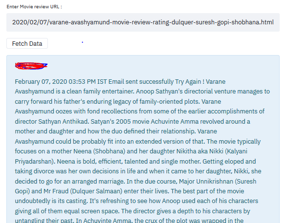
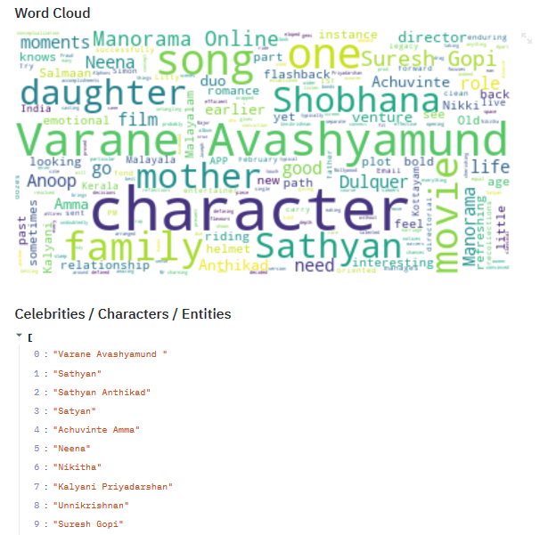
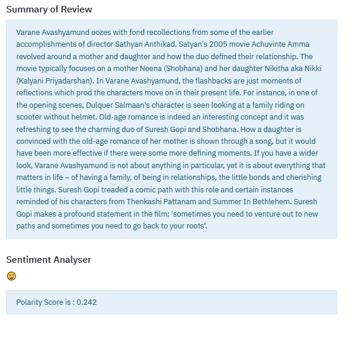

## Review Analyser
+ Application on NLP to Analyse Movie Reviews !

#### Description

This is a Natural Language Processing (NLP) Based App useful for analysing movie reviews.

+ Web Scrapping
+ Summary Generation
+ Sentiment Analysis
+ NER Extraction
+ Word Cloud Generation
+ Emoji Generation

#### Libraies Used
```bash
streamlit
gensim
textblob 
spacy
emoji
BeautifulSoup / urllib
wordcloud / matplotlib
```

#### Run
```bash
streamlit run app.py
```

#### Author
+ Sreejith C
+ https://sites.google.com/site/sreejithc321/

##### Screenshots

#####

##### 

#####

